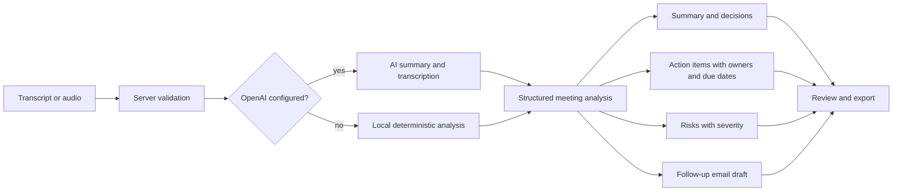

# Meeting Copilot

Meeting Copilot is an AI meeting assistant for turning raw meeting transcripts into a practical operating brief: summary, decisions, action items, risks, and a follow-up email draft. The React client sends transcript data to a Node/Express API, and the browser never calls OpenAI directly.

The project is useful for team leads, operators, product managers, customer success teams, sales teams, and project coordinators who need cleaner handoffs after fast-moving meetings.

## Use Cases

- Operations reviews: capture blockers, accountable owners, due dates, and risks before they disappear into chat.
- Product meetings: summarize customer feedback, product decisions, release risks, and next steps.
- Sales calls: turn discovery notes into follow-up emails, mutual action plans, and deal risks.
- Team standups: extract commitments, unresolved issues, and items that need escalation.
- Customer success check-ins: capture promised follow-ups and sentiment risks without manual note cleanup.

## How It Works

1. Add a meeting title, agenda, context, and transcript in the client.
2. Submit the transcript to the API through `/api/analyze`.
3. The server validates the payload and uses OpenAI when `OPENAI_API_KEY` is configured.
4. If OpenAI is not configured, the server uses a deterministic local parser for summaries, decisions, action items, and risks.
5. The app returns a structured meeting analysis with a follow-up email draft.
6. Users review the result and work from the Markdown brief shown in the client. The shared package also exposes JSON and Markdown formatting helpers.

Audio transcription is available through `/api/transcribe` when the server has an OpenAI key. Audio is uploaded to the server, held in memory for the request, and forwarded from the server to the transcription model.



## Setup

Requirements:

- Node.js 24.x
- npm 11.x

Install dependencies and verify the workspace:

```bash
npm install
npm test
npm run build
```

Copy the example environment file for local development:

```bash
cp .env.example .env.local
```

On Windows PowerShell:

```powershell
Copy-Item .env.example .env.local
```

Set `OPENAI_API_KEY` in `.env.local` only when you want live OpenAI analysis or audio transcription. Without a key, transcript analysis still works through the local fallback.

## Commands

- `npm run dev`: start the API and Vite client together.
- `npm test`: run shared and server tests.
- `npm run build`: build shared types, server output, and the Vite client.
- `npm start`: run the built server.
- `npm run audit`: run `npm audit --audit-level=moderate`.
- `npm run outdated`: run `npm outdated --workspaces --long`.

The API defaults to `http://localhost:8787`. The Vite client proxies `/api` to that API during development.

## Configuration

Use `.env.example` as the public template. Keep real values in `.env.local` or your deployment secret store.

| Variable | Purpose |
| --- | --- |
| `OPENAI_API_KEY` | Optional server-side key for OpenAI analysis and transcription. Leave blank for local fallback analysis. |
| `OPENAI_SUMMARY_MODEL` | Model used by `/api/analyze` when OpenAI is enabled. |
| `OPENAI_TRANSCRIBE_MODEL` | Model used by `/api/transcribe` when OpenAI is enabled. |
| `PORT` | API port. Defaults to `8787`. |
| `CLIENT_ORIGIN` | Allowed browser origin for CORS. Defaults to the Vite dev origin. |

Do not expose OpenAI keys to the browser, commit `.env.local`, or place real meeting transcripts in tracked fixtures.

## Repository map

This repository is an npm workspace monorepo:

```text
client/                 React + Vite meeting workspace
server/                 Express API, OpenAI integration, upload handling, and validation
shared/                 transcript parsing, action extraction, fallback analysis, schemas, and export formatting
.github/workflows/      CI for install, audit, outdated checks, tests, and builds
.github/dependabot.yml  Dependabot updates for npm workspaces and GitHub Actions
.env.example            safe configuration template for local and deployment setup
```

## Privacy and Security Notes

- Meeting transcripts can contain customer data, employee data, commercial strategy, and confidential decisions. Treat transcripts as sensitive by default.
- The current app does not add authentication, durable storage, retention controls, or per-user authorization. Put deployments behind trusted access controls before using it with private meetings.
- The server validates transcript size and structure before analysis. Audio uploads are memory-backed and limited to 50 MB by the API.
- OpenAI calls happen only from the server. The client should never receive provider credentials.
- Review AI output before sending follow-up emails or treating action/risk extraction as authoritative.
- Keep `.env.local`, generated notes, logs, and local meeting exports out of version control.

## Dependency Readiness

Dependencies are checked at the workspace root with `npm outdated --workspaces --long` and `npm audit --audit-level=moderate`. CI runs both checks after `npm ci`, and Dependabot is configured for npm workspace manifests plus GitHub Actions.

## Documentation

- [Architecture diagram source](docs/architecture.mmd)
