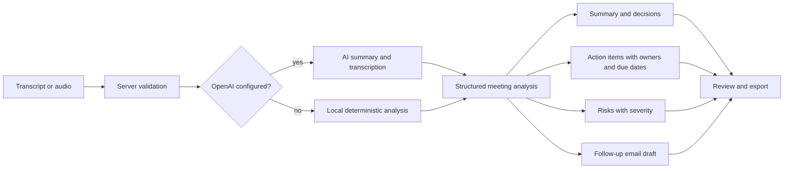

# Architecture

This repository is an npm workspace monorepo with three packages.

| Path | Contents |
| --- | --- |
| `client/` | React + Vite meeting workspace |
| `server/` | Express API, OpenAI integration, upload handling, and validation |
| `shared/` | Transcript parsing, action extraction, fallback analysis, schemas, and export formatting |
| `.github/workflows/` | CI for install, audit, outdated checks, tests, and builds |
| `.github/dependabot.yml` | Dependabot updates for npm workspaces and GitHub Actions |
| `.env.example` | Safe configuration template for local and deployment setup |

## How it works

1. Add a meeting title, agenda, context, and transcript in the client.
2. Submit the transcript to the API through `/api/analyze`.
3. The server validates the payload and uses OpenAI when `OPENAI_API_KEY` is configured.
4. If OpenAI is not configured, the server uses a deterministic local parser for summaries, decisions, action items, and risks.
5. The app returns a structured meeting analysis with a follow up email draft.
6. Users review the result and work from the Markdown brief shown in the client. The shared package also exposes JSON and Markdown formatting helpers.

Audio transcription is available through `/api/transcribe` when the server has an OpenAI key. Audio is uploaded to the server, held in memory for the request, and forwarded from the server to the transcription model.

The API defaults to `http://localhost:8787`. The Vite client proxies `/api` to that API during development.

The diagram source is [architecture.mmd](architecture.mmd).

